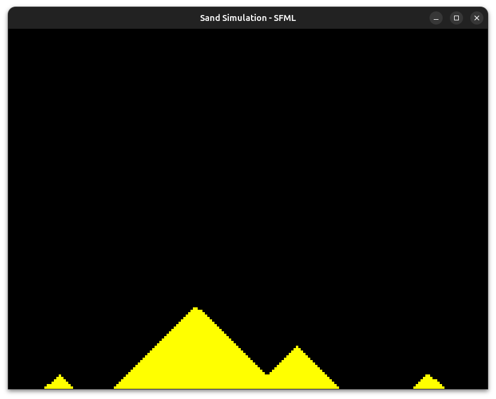

# Sand Simulation
Welcome to your first graphics + simulation task!
In this task, you’ll be creating a sand falling simulator using C++ and the SFML (Simple and Fast Multimedia Library). This is a hands-on introduction to combining physics simulation with real-time graphics rendering, and a great opportunity to improve your skills in modern C++ programming.

You'll simulate sand particles under the power of gravity, which collide with one another and settle into patterns that look like nature. The particles must act naturally—falling, piling, and sliding—like sand in real life.
By the end of this project, you’ll have created a fully functional visual simulation of falling sand—similar to classic sandbox games. More importantly, you’ll gain a solid understanding of C++ programming, real-time simulations, and graphics development.



## Getting Started
1. To begin create a repository in you Github account and clone it.
2. Install the following packages
- g++ (For compiling and linking)
- SFML (For rendering)

For Ubuntu / Debian / Linux Mint
```
sudo apt-get install build-essential
sudo apt install libsfml-dev
```
For any other distros, refer to [SFML Download guide](https://www.sfml-dev.org/download/sfml/3.0.0/)

3. Create a file named main.cpp and paste the example code
``` C++
#include <SFML/Graphics.hpp>

int main()
{
    sf::RenderWindow window(sf::VideoMode({200, 200}), "SFML works!");
    sf::CircleShape shape(100.f);
    shape.setFillColor(sf::Color::Green);

    while (window.isOpen())
    {
        while (const std::optional event = window.pollEvent())
        {
            if (event->is<sf::Event::Closed>())
                window.close();
        }

        window.clear();
        window.draw(shape);
        window.display();
    }
}
```
4. Compile the code and link to sfml library using g++
```
g++ -c main.cpp
```
5. To link the SFML library
```
g++ main.cpp -o sfml-app -lsfml-graphics -lsfml-window -lsfml-system
```
6. Now simply run `./sfml-app` from terminal.

<b>Happy Coding!</b>